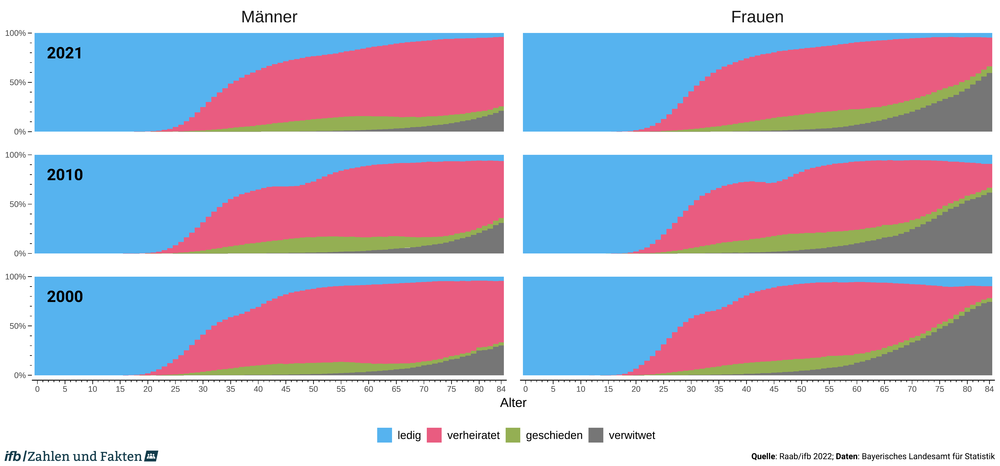

```{r setup, include=FALSE}
knitr::opts_chunk$set(echo = TRUE)
```

[*Marcel Raab*](https://marcelraab.de/)*, [Staatsinstitut für Familienforschung an der Universität Bamberg](https://www.ifb.bayern.de/)*

Dieses kleine Repository enthält die Daten und den Code zur Erstellung von Abbildungen für die Rubrik "Bevölkerungsstruktur" auf der "Zahlen und Fakten"-Webseite des ifbs. Bei den Abbildungen handelt es sich um Bevölkerungsdiagramme mit Familienstandsgliederung sowie um Balkendiagramme zur Visualisieung alters- und geschlechtsspezifischer relativer Häufigkeiten des Familienstands für die Jahre 2000, 2010 und 2021.

### Bevölkerungspyramiden mit Familienstandsgliederung


### Altersspezifische Verteilungen des Familienstands



### Häufigkeiten des im jeweiligen Alter am meist beobachteten Familienstands


## Quellen

Die Daten für die Abbildung kommen vom Bayerischen Landesamt für Statistik sowie dem Statistischen Bundesamt.

Die Darstellung der Bevölkerungsdiagramme ("Pyramiden") orientiert sich an der BiB-Broschüre "Demografischen Wandel neu entdecken" und basiert im Wesentlichen auf den vom [Bundesinstitut für Bevölkerungsforshung](https://www.bib.bund.de/) und [Cédric Scherer](https://cedricscherer.netlify.app/) zur Verfügung gestellten [R-Code](https://github.com/z3tt/BiB-population-pyramids).

Da wir hier anders als das BiB vorerst lediglich auf frei verfügbare Daten zurückgreifen und daher nur eine Abbildung mit Bevölkerungsdiagrammen erstellt haben, haben wir darauf verzichtet wiederverwendbare Funktionen für die Erstellung der Plots zu verwenden. Mithin befindet sich der komplette Code für die Bevölkerungsdiagrammen in einem einzelnen R-Skript (`Pyramiden.R`).

Die beiden anderen Abbildungen wurden mit dem zweiten Skript `Verteilungen.R` erstellt.

## Danksagung

Wir möchten uns an dieser Stelle nochmal bei allen Beteiligten beim BiB sowie bei Cédric Scherer für die Arbeit am Projekt "Demografischen Wandel neu entdecken" und das Teilen des Codes bedanken. Ohne dieses exzellente Material hätten wir dieses kleine Nebenprojekt nicht in Angriff genommen.

------------------------------------------------------------------------

**Weitere Pyramiden für Gesamt-Deutschland**

Weitere Pyramiden für die Bundesrepublik Deutschland finden sich auf der Seite des BiB: www.bib.bund.de/pyramiden

------------------------------------------------------------------------

[](https://www.ifb.bayern.de/)

[](https://creativecommons.org/licenses/by-sa/4.0/)
