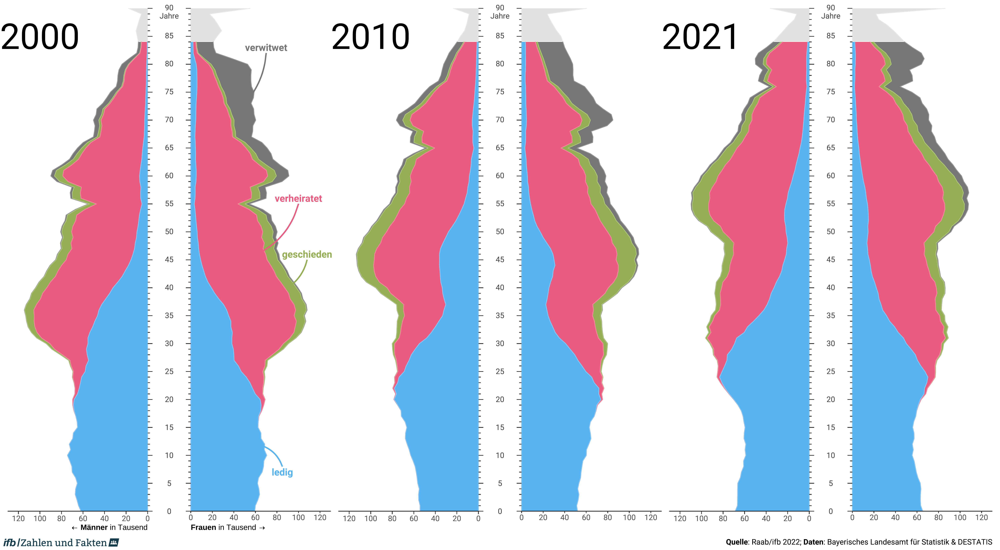

Bayerische Bevölkerungspyramiden nach Familienstand (2000 - 2010 - 2021)
================

*[Marcel Raab](https://marcelraab.de/), [Staatsinstitut für
Familienforschung an der Universität
Bamberg](https://www.ifb.bayern.de/)*

Dieses kleine Repository enthält die Daten und den Code zur Erstellung
einer Abbildung dreier Bevölkerungspyramiden für Bayern. Die Pyramiden
differenzieren nach Familienstand und bilden die Populationsverteilungen
für die Jahre 2000, 2010 und 2021 ab.

<!-- -->

## Quellen

Die Daten für die Abbildung kommen vom Bayerischen Landesamt für
Statistik sowie dem Statistischen Bundesamt.

Die Abbildung orientiert sich an der BiB-Broschüre “Demografischen
Wandel neu entdecken” und basiert im Wesentlichen auf den vom BiB und
Cédric Scherer zur Verfügung gestellten
[Code](https://github.com/z3tt/BiB-population-pyramids).

Da wir hier anders als das BiB vorerst lediglich auf frei verfügbare
Daten zurückgreifen und daher nur eine Abbildung erstellen, haben wir
darauf verzichtet wiederverwendbare Funktionen für die Erstellung der
Plots zu verwenden. Mithin befindet sich der komplette Code in einem
einzelnen R-Skript.

## Danksagung

Wir möchten uns an dieser Stelle nochmal bei allen Beteiligten vom BiB
sowie bei Cédric Scherer für die exzellente Arbeit und das Teilen des Codes
bedanken. Ohne dieses exzellente Material hätten wir dieses kleine
Nebenprojekt nicht in Angriff genommen.

------------------------------------------------------------------------

**Weitere Pyramiden für Gesamt-Deutschland**

Weitere Pyramiden für die Bundesrepublik Deutschland finden sich auf der
Seite des BiB: www.bib.bund.de/pyramiden

------------------------------------------------------------------------

